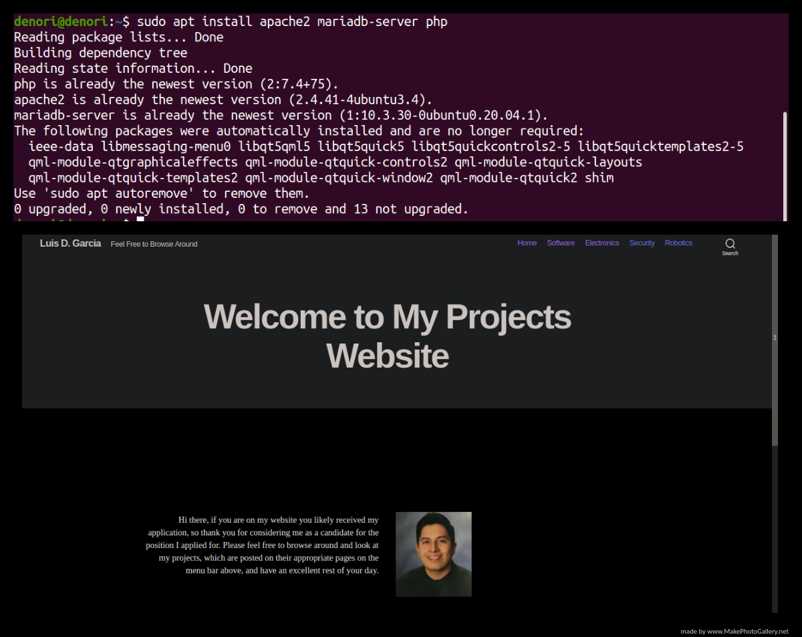

# Installing-a-LAMP-Server

<h2>Motivation for Project</h2>

Prior to posting my projects here I hosted them on my personal website, which I created by running my own LAMP (Linux, Apache, MySQL, PHP) Server. The L in LAMP, which stands for Linux was simple, since I comfortable navigating, using, installing, and removing software on Linux. Hence, what made downloading Apache, MySQL, and PHP a breeze. 

However, the difficulty rose as soon as I needed to configure the proper settings for instance on Apache I had to go to ports.conf file and default.conf file in the sites-available directory and modify them to accept https and listen to ports which I enable port-forwarding on. Also, my two best resources for this project were found on <a href="https://projects.raspberrypi.org/en/projects/lamp-web-server-with-wordpress/">Raspberry Pi’s LAMP server tutorial</a> and this post on <a href="https://www.atlantic.net/vps-hosting/install-lamp-server-with-lets-encrypt-free-ssl-on-ubuntu-18-04/">Installing a LAMP server with Certbot</a>.

Although my two resources helped greatly in installing the LAMP server I learned how to port forward using another <a href="https://www.youtube.com/watch?v=jfSLxs40sIw">tutorial</a> on YouTube, but it took another hour to understand which ports to enable for my website to listen to. 

For instance, I just enabled my website to listen on port 80 (the default web server port), but when I added a https certificate aftering installing Certbot I also needed to make my website listen to port 443 (the web server port for a web server with a https certificate). Without my website listening to port 443 my website would continually crash in that not of my pages would load, but this also lead to another learning experience. 

When I finally got my website to listen to port 443, my webpages would still not load since their links were not “luisdgarcia.sytes.net/electronics” and so forth instead the links had my local IP address which meant that when I searched my website on my Phone the website would not load the WordPress edits I made due to my Phone having its own local IP address. The solution however, turned out to be simple I just needed to change the permalink on each page to have my domain name instead of my local IP address.

